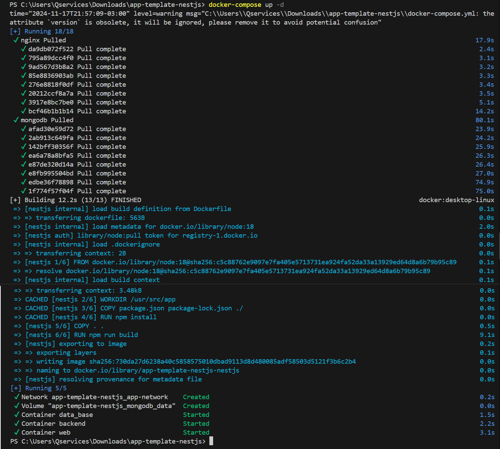
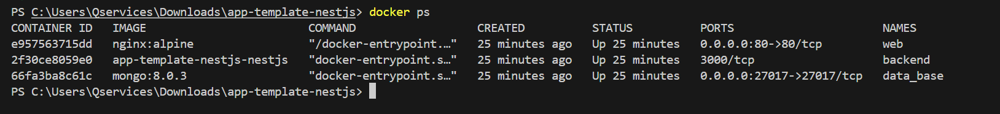
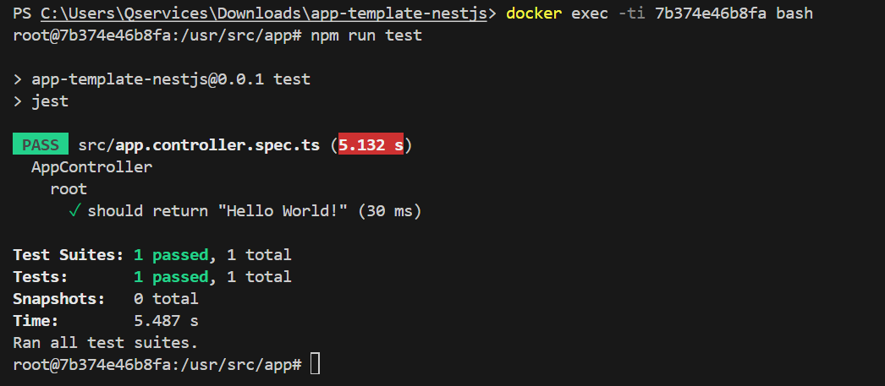

<p align="center">
  <a href="http://nestjs.com/" target="blank"></a>
</p>

[circleci-image]: https://img.shields.io/circleci/build/github/nestjs/nest/master?token=abc123def456
[circleci-url]: https://circleci.com/gh/nestjs/nest

  <p align="center">A progressive <a href="http://nodejs.org" target="_blank">Node.js</a> framework for building efficient and scalable server-side applications.</p>
    <p align="center">
<a href="https://www.npmjs.com/~nestjscore" target="_blank"></a>
<a href="https://www.npmjs.com/~nestjscore" target="_blank"></a>
<a href="https://www.npmjs.com/~nestjscore" target="_blank"></a>
<a href="https://circleci.com/gh/nestjs/nest" target="_blank"></a>
<a href="https://coveralls.io/github/nestjs/nest?branch=master" target="_blank"></a>
<a href="https://discord.gg/G7Qnnhy" target="_blank"></a>
<a href="https://opencollective.com/nest#backer" target="_blank"></a>
<a href="https://opencollective.com/nest#sponsor" target="_blank"></a>
  <a href="https://paypal.me/kamilmysliwiec" target="_blank"></a>
    <a href="https://opencollective.com/nest#sponsor"  target="_blank"></a>
  <a href="https://twitter.com/nestframework" target="_blank"></a>
</p>
  <!--[](https://opencollective.com/nest#backer)
  [](https://opencollective.com/nest#sponsor)-->

## Descripción

En este desafío, vamos a crear un archivo Dockerfile para construir la aplicación NestJS y un archivo docker-compose.yml para levantar un entorno completo con Nginx (frontend), NestJS (backend), y MongoDB (base de datos). Este entorno permitirá a los desarrolladores trabajar localmente con facilidad.

## Ejecutar el proyecto

Se debe clonar el repositorio y acceder a la carpeta del proyecto
```bash
git clone https://github.com/HidalgoKevin/app-template-nestjs.git

cd app-template-nestjs
```

Una vez dentro de la carpeta se debe ejecutar el siguiente comando que realizara la creacion de los contenedores.

```bash
docker-compose up -d
```

<p align="center">
<a href="#" target="_blank" rel="noopener noreferrer">

</a>
</p>

Una vez creado, se puede validar si estan activos usando el comando:

```bash
docker ps
```

<p align="center">
<a href="#" target="_blank" rel="noopener noreferrer">

</a>
</p>

## Ejecutar Tests

Para comprobar el funcionamiento se pueden realizar los siguientes tests.

```bash
# unit tests
$ npm run test
```

Resultado esperado:

<p align="center">
<a href="#" target="_blank" rel="noopener noreferrer">

</a>
</p>

```bash
# e2e tests
$ npm run test:e2e
```

Resultado esperado:

<p align="center">
<a href="#" target="_blank" rel="noopener noreferrer">

</a>
</p>

```bash
# test coverage
$ npm run test:cov
```

Resultado esperado:

<p align="center">
<a href="#" target="_blank" rel="noopener noreferrer">

</a>
</p>